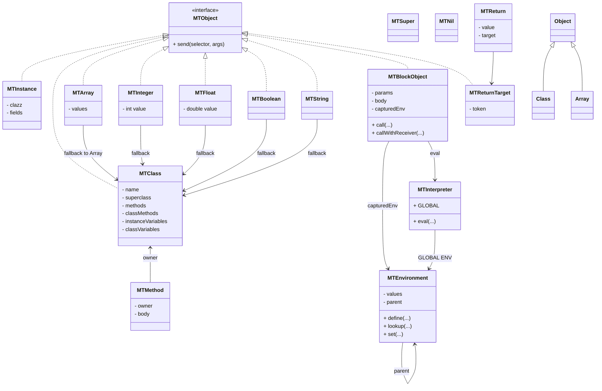

# MiniTalk

MiniTalk est un langage objet inspiré de Smalltalk, implémenté en Java avec l'aide de Copilot.

Le but de cette construction est multiple :
1. apprendre le Java
2. créer un petit langage de scripting facile à utiliser purement objet.
3. apprendre à utiliser l'IA pour mes développements

Je connais les à-priori de certains vis à vis de l'IA mais honnêtement,
travailler avec elle est un vrai gain de temps : au lieu de passer un mois
pour obtenir un premier prototype fonctionnel, j'ai seulement mis une semaine !
Par contre, tenir en laisse une IA pour qu'elle fasse ce que vous voulez
n'est pas de tout repos : parfois elle se met à faire des modifications
puis à revenir en arrière puis repartir en avant ... c'est un peu déstabilisant.

## Principales fonctionalités de miniTalk

- un langage de la famille SmallTalk mais n'est pas du SmallTalk
- objets dynamiques
- classes et héritage
- setter et getter automatiques (construits à partir des noms des variables)
- variables et méthodes d'instance et de classe
- pas de système de metaclasses (même si "intellectuellement" c'était moins
  satisfaisant que des classes qui sont vraiment des objets et non de
  nouveaux types spécifiques d'objets, je voulais garder les choses simples
  et les métaclasses auraient entraîné trop de complexité dans le code)
- blocs avec closures
- super + return (^)
- collections
- traitement des chaines de caractères
- de librairies de méthodes et classes
- et, cerise sur le gateau, une interopérabilité avec les classes Java
  dans le langage et dans le code, avec la possibilité de mapper les
  méthodes Java avec d'autres noms dans miniTalk

## utilisation du langage

java -cp <rep classes> mt.Main -L *dir_libs*

- toutes les instructions se terminent par un '.'

- les commentaires sont encadrés par des doubles guillemets.

  Exemple : "ceci est un commentaire"

- tout est objet (les nombres, les classes, les méthodes, les blocks, etc.)

- par convention :
  * les noms de classes commencent par une majuscule
  * les noms d'instances et de méthodes commencent par une minuscule
  * les noms de méthodes ne comportent que des caractères alphabétiques
    et, s'il sont composés, ont une majuscule sur chaque terme.
    
    Exemple : uneMethode

- l'affectation se fait comme en Pascal.

  Exemple : var := *expression*.
  
  Alternativement, et c'est peut-être plus parlant, on peut utiliser '<-'.
  
  Exemple : var <- *expression*.

- toutes les instructions commencent par un objet auquel on adresse
  une succession de messages. ces messages sont de plusieurs type :
  - messages unaires : c'est un mot clé correspondant à une méthode.

    Exemple : "a name."
  - messages binaires : ce sont des mots clé réclamant un argument. Il faut
    qu'ils se terminent par ':'.
    
    Exemple : "a name: 'Julian'."
  
### les types de bases

Les classes sont des objets spéciaux dans le langage miniTalk.

Elles sont organisées en une arborescence qui permet de dériver facilement d'autres classes, miniTalk en proposant un système d'héritage pour les méthodes et les propriétés, ainsi qu'un mécanisme de surcharge des opérateurs et des méthodes.

Quelques Classes prédéfinies utiles :
- **SmallInteger** : entiers mappés sur le type "int" de Java. Ils sont donc
  limités à l'intervalle [ -2**32, +2**32 - 1] sur les infrastructure 64b.

- **String** : chaines de caractères, délimitées par des simples quotes.

  Exemple: 'ceci est une chaine de caractères.'
  
- **Array** : permet de construire des tableaux. L'indice d'un tableau
  commence toujours à 1.
  
  Il existe deux méthodes pour créer un tableau :
  
  - la création directe :
  
    Exemple : a := #( 10 3 7 0 ).

  - la création puis l'alimentation du tableau. Exemple :
     * v <- Array new: 20.
     * v at: 1 put 39.
     * etc.
    
  Un tableau peut contenir des éléments de nature hétérogène :
  - a := #( 23 'rue Paul Vaillant' 59000 'Lille' ).
- **Object** : c'est la classe racine de toute l'aborescence
- **Class** : c'est un objet spécial qui permet d'unifier le comportement de toutes les classes
- **System** : c'est une classe porte-manteau pour supporter les méthodes altérant le langage (chargement des librairies par exemple).

Si vous avez envie de vous prendre la tête, ci-après le diagramme UML de miniTalk.

### schéma UML de miniTalk



### les blocs
Les blocs sont des séquences d'instructions délimités par des crochets : [ ].

- les instructions doivent se terminer par des .
- une exception à la règle précédente :
  le point est facultatif pour la dernière instruction d'un bloc.
- il est possible d'implémenter des "closures", véritables fonctions
  anonymes avec leurs arguments. Par exemple :
  [ :x :y | x + y ].

### les structures de contrôle

#### les tests
- cond **ifTrue: [** bloc **].** <- exécute le bloc si la condition est vraie
- cond **ifFalse: [** bloc **].** <- exécute le bloc si la condition est fausse
- cond **ifTrue: [** bloc **] else: [** bloc **].** <- exécute le premier bloc
  si la condition est vraie, et le second dans le cas contraire
- cond **ifFalse: [** bloc **] else: [** bloc **].** <- exécute le premier
  bloc si la condition est fausse, et le second si elle est vraie

#### les boucles
- a **to:** b **do: [** bloc **].** <- exécute bloc (b - a + 1) fois si b > a, et (a - b + 1) fois si a > b.
- a **to:** b **step:** s **do: [** bloc **].** <- exécute le bloc 
- cond **whileTrue: [** bloc **].** <- exécute le bloc tant que la
  condition est vraie.
- cond **whileFalse: [** bloc **].** <- exécute le bloc jusqu'à ce que
  la condition soit vraie (équivalent d'un repeat ... until dans
  d'autres langages).

### les fonctions sur les tableaux
- anArray **do: [ :x |** bloc **].** <- applique bloc à chaque élément de l'array. Attention l'array initial n'est pas modifiés (effet de bord)!
- anArray **collect: [ :x |** bloc **].** <- crée un nouvel array avec le résultat de l'application du bloc à chaque élément (transformation) ! C'est l'équivalent du "map" en Lisp.
- anArray **select: [ :x |** cond(x) **].** <- crée un nouvel array avec tous les éléments respectant la condition. C'est l'équivalent du filter en Lisp.
- anArray **reject: [ :x |** cond(x) **].** <- crée un nouvel array avec tous les éléments qui **ne** respectent **pas** la condition.
- anArray **detect: [ :x |** cond(x) **].** <- retourne le premier élément pour lequel la condition est vraie.
- anArray **anySatisfy: [ :x |** cond(x) **].** <- retourne vrai si un seul des élément du tableau satisfait la condition.
- anArray **allSatisfy: [ :x |** cond(x) **].** <- retourne vrai si tous les éléments du tableau satisfont la condition.
- anArray **inject:** valDepart **into: [** :acc :elem **|** fct(elem) **].** <- retourne la valeur de acc suite aux transformations suivantes : acc initialisé avec valDepart, puis, pour chaque élément du tableau, applique la fonction fct qui va modifier acc en fonction de l'élément en cours dans le tableau. C'est l'équivalent du "reduce" en programmation fonctionnelle. Exemple : créer un chaîne 'abcd' à partir d'un tableau de caractères : #('a' 'b' 'c' 'd') inject: '' into: [ :acc :x | acc , x ].

## Exemples
```

a := Array new: 5. "on crée un tableau"
a at: 1 put: 23.   "on valorise son premier élément"
a at: 2 put: 47.
a map: [ :x | x * 2 ] dbg.

Person := Class new: 'Person'.
Person addClassVar: species.
Person species: 'Homo Sapiens'.
Person species.

Person addInstVar: name.
Person addInstVar: age.
p := Person new.
p name: 'Andy'.
p age: 36.
